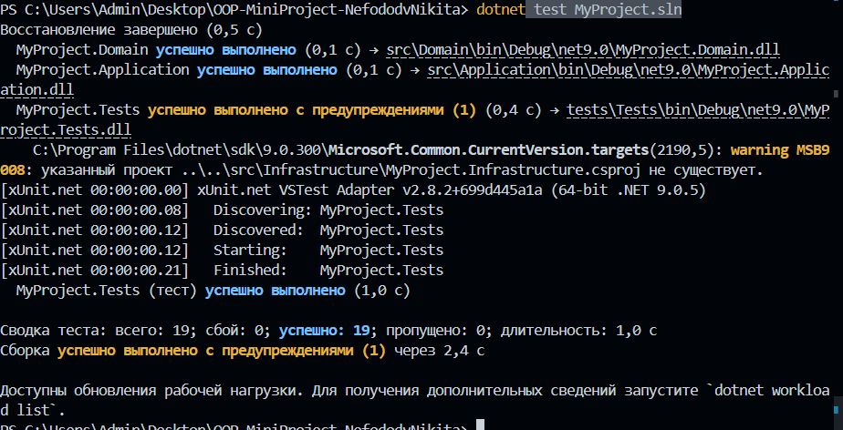

# План та Звіт: Ітерація 2 (Lab 35) — Thule-WMS

## 1. План розробки (Гілка: `lab35-business-and-persistence`)

### Сценарії з Backlog в реалізацію:
* **Strategy:** Автопідбір оптимальної зони для оприбуткування товару.
* **Observer:** Моніторинг місткості в реальному часі зі сповіщенням при $\ge 90\%$.
* **Persistence:** Асинхронний файловий I/O (JSON) з Retry-підходом.
* **LINQ-запити:** Аналітичні звіти, фільтрація та сортування в UI.

### Стабільні класи (без змін):
* Сутність `Product`, об'єкти-значення `SKU` та `ZoneAddress`, поліморфні ролі `WarehouseWorker`.

### Точки розширення (SOLID / OCP):
* Інтерфейс `IPlacementStrategy` — для нових алгоритмів розміщення.
* C# події (`event`) та делегати — для підключення будь-яких типів `Observer`.
* Generics (`IRepository<T, TId>`, `IDataStore<T>`) — відокремлення RAM-логіки від дискового I/O.

### Ризики та рішення:
* *Дублювання I/O логіки:* Вирішено єдиним generic-сховищем `JsonDataStore<T>`.
* *Слабкі інтерфейси:* Додано `GetAll() -> IReadOnlyCollection<T>` для захисту колекцій від мутацій.
* *Конфлікти асинхронного I/O:* Впроваджено Retry-механізм при блокуванні файлів.

---

## 2. Бізнес-сценарії та правила

### Реалізовані Use Cases:
1. `ReceiveProductUseCase` — автоматичний підбір зони та приймання товару (розширено з Lab 34).
2. `ShipProductUseCase` — списання товару з конкретної комірки.
3. `TransferProductUseCase` — транзакційне переміщення залишків між зонами.

### Фіксація бізнес-правил (Quality Gate):
* **[Rule_1]** Валідація кількості: операції дозволені лише для $\text{Qty} > 0$ (`ArgumentException`).
* **[Rule_2]** Максимальна місткість: заборона перевищення `MaxCapacityWeight` (`InvalidOperationException`).
* **[Rule_3]** Попередження $\ge 90\%$: автоматичний тригер події `OnCapacityWarning`.
* **[Rule_4]** Захист від від'ємного залишку: заборона списання більшої кількості, ніж є в наявності.
* **[Rule_5]** Очищення пам'яті: Dictionary `Items` видаляє ключі товарів, чий залишок став $0$.

---

## Обґрунтування патернів (Завдання 4)

* **Strategy (`IPlacementStrategy`):** Ізолює алгоритми підбору зон від домену. Без нього Use Case містив би складні `if-else`/`switch`. На Lab 37 дозволить додати `HeavyLoadPlacementStrategy` (сортування за рівнем стелажів) без зміни робочого коду.
* **Observer (`event`):** Дозволяє домену сигналізувати про переповнення, не знаючи про інфраструктуру (UI, логери). Без нього ядро залежало б від консолі. На Lab 37 дозволить підключити `TelegramBotObserver` чи логер.
* **Factory (`StrategyFactory`):** Інкапсулює створення об'єктів-стратегій за текстовим запитом. На Lab 37 дозволить міняти алгоритми "на льоту" через конфіг `appsettings.json`.

---

## Аналітика, UI та Тести (Завдання 5, 6, 7)

### LINQ та Спеціалізовані колекції:
* **Спеціалізована колекція:** `Dictionary<Guid, int>` для унікальності SKU в комірці та пошуку за $O(1)$.
* **4 LINQ-запити + Агрегація:**
  1. Фільтрація зон із завантаженням $\ge 85\%$ (`Where`, `OrderByDescending`).
  2. Пошук локацій конкретного SKU з проєкцією в анонімні типи (`Where`, `Select`).
  3. Топ-3 найвільніших посилених зон для важких вантажів (`Where`, `OrderBy`, `Take`).
  4. Групування адрес комірок за логічними секторами складу (`ToLookup`).
  5. *Агрегація:* Розрахунок загального тонажу та сумарного % завантаженості складу через `Sum()`.

### Консольний інтерфейс:
* Клас `Program` виконує лише роль чистого представлення (UI). Він зчитує вхідні дані, викликає Use Cases/Аналітику та обробляє об'єкт `Result<T>`. Бізнес-логіка не дублюється. Стан автоматично відновлюється з JSON при старті й фіксується при кожній операції.

### Звіт про тестове покриття (12 xUnit тестів):
* **Інваріанти:** Валідація форматів SKU, ваги та лімітів у конструкторах.
* **Правила:** Тести на переповнення, захист від від'ємних залишків та очищення Dictionary.
* **Патерни:** Перевірка вибору зони через `FastAccessStrategy` та детонації події `Observer`.
* **Persistence:** Перевірка асинхронного створення файлу на диску та стійкості до пошкодженого JSON.

---

## Відповіді на  питання

### 1. Чому persistence-шар повинен залежати від контрактів, а не навпаки?
Це головна ідея **принципу інверсії залежностей (Dependency Inversion — DIP із SOLID)**. Контракти (інтерфейси) описують *бізнес-потреби* системи і є частиною шару `Application` або `Domain`. `Infrastructure` (Persistence) — це просто низькорівнева технічна деталь (сьогодні це JSON, завтра — SQL база даних). Якщо інтерфейси будуть залежати від конкретного JSON-класу, ми ніколи не зможемо змінити технологію збереження, не переписавши при цьому всю бізнес-логіку програми.

### 2. Які з ваших бізнес-правил належать сутностям, а які сервісам?
* **Сутностям (`StorageZone`):** Належать правила контролю власного внутрішнього стану (інваріанти). Наприклад: заборона перевищення максимальної ваги (`MaxCapacityWeight`), валідація формату `SKU`, або автоматичне видалення порожніх ключів товарів із Dictionary. Сутність самостійно гарантує свою цілісність у пам'яті.
* **Сервісам (`Use Cases`):** Належать правила координації, перевірки зовнішнього контексту та потоку даних. Наприклад: дізнатися у фабрики, яку стратегію застосувати, перевірити, чи взагалі існує такий товар у каталозі репозиторію, та зберегти фінальний результат на диск через `DataStore`.

### 3. Чому LINQ-запити мають бути частиною бізнес-сценарію, а не окремою “лабораторною прикрасою”?
У реальних комерційних системах LINQ-запити — це інструмент виконання **критично важливої бізнес-аналітики** (Reporting & Analytics). Наприклад, наш запит `GetCriticalZonesAsync` (пошук зон, заповнених понад 85%) — це не просто «прикраса», а реальний тригер для логіста, який показує, які сектори складу заблоковані і потребують негайного термінового розвантаження для уникнення простою підприємства.

### 4. Як обраний патерн проєктування допоміг уникнути жорсткого кодування поведінки?
Патерн **Strategy** (`IPlacementStrategy`) повністю усунув жорстке кодування (Hardcoding) алгоритмів розміщення товарів. Замість того, щоб зашивати логіку вибору комірки всередину Use Case через довгі конструкції `if-else` або `switch`, Use Case приймає абстракцію. Це дозволяє нам змінювати поведінку системи "на льоту" (наприклад, перемикатися з пошуку найвільнішої комірки на пошук посиленого стелажа для важких вантажів), просто передаючи інший об'єкт-стратегію без переписування коду ядра.

### 5. Що саме Lab 36 повинна довести про ваш код після цієї ітерації?
Лабораторна 36 (Інтеграційне тестування) повинна довести **архітектурну життєздатність та надійність стикування шарів**. Якщо юніт-тести перевіряли isolated (ізольовані) класи в RAM, то інтеграційні тести мають довести, що:
1. Шари `Domainv- Application - Infrastructure` працюють разом як єдиний злагоджений механізм.
2. Дані реально долітають до файлової системи, серіалізуються у валідний JSON і не губляться при зчитуванні.
3. Система стійко поводиться при виникненні технічних аварій (наприклад, коли файл даних заблоковано іншим процесом під час запису).

